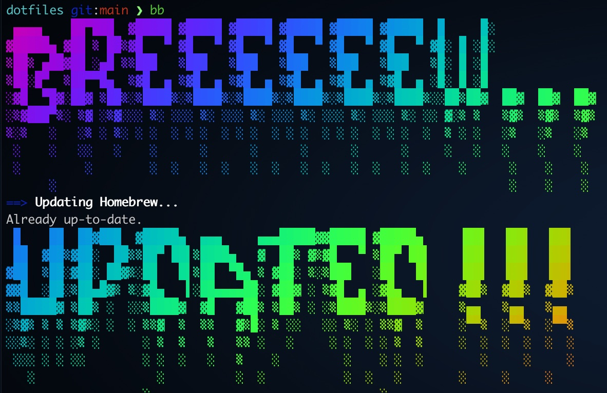

# Dotfile

Change permission for `setup.sh` and run this setup script:

```bash
$ chmod +x setup.sh
$ ./setup.sh
```

### Use brew-update-upgrade-cleanup-doctor.sh

This will execute the four commands for:

```bash
$ brew update && brew upgrade && brew cleanup && brew doctor
```

```bash
$ ./brew-update-upgrade-cleanup-doctor.sh
```



**NOTES**: create an alias for this script and add it to your `.zshrc`, e.g. `$ bb`


## Still, a lot of TODOs...

- zshrc
